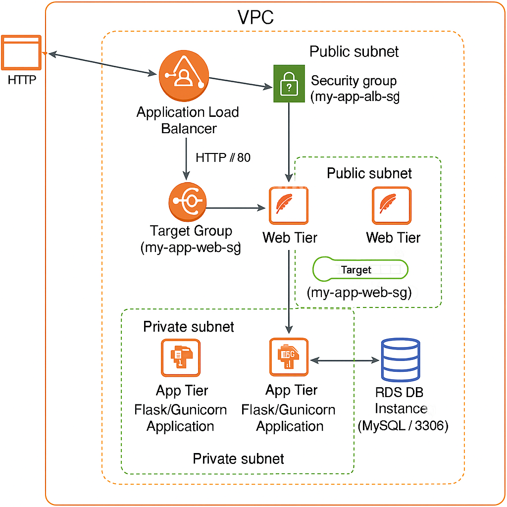

# Manual Deployment Of A Multi-Tiered Web Application 

## Project Overview

## Features

 * Multi-Tiered Architecture: Separates concerns into distinct web, application, and database tiers for improved organization and scalability.
 * Custom VPC Configuration: Deploys the application within an isolated virtual network, including public and private subnets, for controlled network access.
 * Internet Connectivity: Utilizes an Internet Gateway for public subnet internet access and a NAT Gateway for private subnet outbound internet connectivity.
 * Granular Security Control: Implements specific Security Groups for the ALB, Web Tier, App Tier, and RDS to manage inbound and outbound traffic flows.
 * Managed Database Service: Integrates with Amazon RDS for MySQL as the database tier, ensuring data persistence and high availability.
 * Load Balancing: Leverages an Application Load Balancer (ALB) to distribute incoming web traffic to the web server instances, enhancing availability and performance.
 * Session Manager Access: Configures IAM roles for Session Manager to provide secure, browser-based access to EC2 instances without needing SSH keys.
 * Web Server (Apache) Proxy: Uses Apache to serve as a reverse proxy, handling public traffic and forwarding requests to the internal application tier.
 * Python Flask Application: Runs a Python Flask application as the backend, connecting to the RDS database to serve dynamic content.
 * Systemd Service Management: Configures the Flask/Gunicorn application as a systemd service for automatic startup.

## Technologies Used
Amazon Web Services (AWS):
 - VPC: Virtual Private Cloud for network isolation.
 - EC2: Elastic Compute Cloud for virtual servers (Web Tier and App Tier instances).
 - RDS: Relational Database Service (MySQL) for managed database.
 - ALB: Application Load Balancer for traffic distribution.
 - IAM: Identity and Access Management for roles (e.g., Session Manager access).
 - Internet Gateway (IGW): For public subnet internet access.
 - NAT Gateway (NAT GW): For private subnet outbound internet access.
 - Security Groups: For network traffic filtering.
 - Route Tables: For network routing within the VPC.

Operating System:
 - Amazon Linux 2 AMI or Amazon Linux 2023 AMI.

Web Server:
 - Apache HTTP Server.

Application Framework:
 - Flask (Python).

WSGI Server:
 - Gunicorn.

Database Connector:
 - PyMySQL (Python).

Database:
 - MySQL.

Text Editor:
 - vim.

## Getting Started

### Prerequisites 

 - An active AWS Account with appropriate permissions to create and manage VPCs, EC2 instances, RDS databases, Load Balancers, IAM roles, and security groups.
 - Basic understanding of AWS Console Navigation.
 - Familiarity with Linux command-line operations (e.g., sudo, yum, systemctl, vim, mkdir, ls).
 - Knowledge of HTTP/HTTPS protocols and networking concepts (e.g., CIDR blocks, subnets, route tables).

### Deployment Steps

Follow these main phases to get your application up and running on AWS.

#### Set Up Your Network (VPC & Subnets)

 - Create a Virtual Private Cloud (VPC):* - Your isolated network space.
    - `my-app-vpc` (e.g., `10.0.0.0/16`)
 - Divide into Subnets:
    - Two *Public Subnets*  (`my-app-public-subnet-1a`, `my-app-public-subnet-1b`) for public-facing resources (like load balancers).
    - Two *Private Subnets* - (`my-app-private-subnet-2a`, `my-app-private-subnet-2b`) for internal resources (like application servers and databases).

#### Configure Network Connectivity

 - Internet Gateway (IGW): Allows internet access *into* your public subnets.
    - `my-app-igw`
 - NAT Gateway (NAT GW): Allows resources in your private subnets to access the internet without being directly exposed.
    - `my-app-nat-gw` (placed in a public subnet)
 - Route Tables: Direct traffic within your VPC and to/from the internet.
    - *Public Route Table*: - Routes public subnet traffic through the IGW.
    - *Private Route Table*: - Routes private subnet traffic through the NAT Gateway for outbound internet access.

#### Create Security Groups

 - `my-app-alb-sg`: For the Load Balancer (allows internet traffic).
 - `my-app-web-sg`: For Web Servers (allows traffic from the ALB).
 - `my-app-app-sg`: For Application Servers (allows traffic from Web Servers).
 - `my-app-rds-sg`: For the Database (allows traffic only from Application Servers).

#### Set Up Database (RDS)

Launch your managed database service for persistent data storage.

 - DB Subnet Group: - Groups your private subnets for multi-AZ database deployment.
    - `my-app-rds-subnet-group`
 - RDS Database Instance:* - Your MySQL/PostgreSQL database.
    - `my-app-db` (ensure it's in private subnets, not publicly accessible).
    - Crucial:* Note down its *Endpoint* and *Port*.

#### Create Load Balancer (ALB) & Target Groups

Distribute incoming requests and define where they should go.

 - Target Groups: Define groups of instances that will receive traffic.
    - `my-app-web-tg`: For your Web Servers (Apache).
    - `my-app-app-tg`: For your Application Servers (Flask/Gunicorn).
 - Application Load Balancer (ALB): The entry point for web traffic.
    - `my-app-alb` (internet-facing, points to `my-app-web-tg`).

#### Launch & Configure Servers (EC2 Instances)

Deploy your virtual servers and install necessary software.

 - IAM Role for Session Manager: Allows secure browser-based access to your EC2 instances.
    - `my-app-ec2-ssm-role`
 - Web Tier Instances (`my-app-web-instance`):
    - Located in *public subnets*.
    - Install *Apache* - and configure it to proxy requests to your App Tier.
 - App Tier Instances (`my-app-app-instance`):
    - Located in *private subnets*.
    - Install *Python, Flask, Gunicorn*, and your application code.
    - Important: Update your Flask app's database connection details using the RDS Endpoint.
    - Crucial Update: Once the App Tier instance is running, get its *Private IP address**. Go back to your Web Tier instance's user data and update the Apache proxy configuration with this private IP.
 - Register Instances with Target Groups:- Make sure your `my-app-web-instance` is registered with `my-app-web-tg`, and `my-app-app-instance` is with `my-app-app-tg`.

#### Verification

 - Check Health Checks: 
    - In the EC2 console, confirm that all instances in both `my-app-web-tg` and `my-app-app-tg` are showing as `healthy`.

 - Test Application:
    - Get the *DNS name* - of your `my-app-alb` from the EC2 Load Balancers section.
    - Paste this DNS name into your web browser. You should see your application running!

 - Test Connection To RDS Instance:
    - Use `mysql -h  my-appd-db.cj82y0c0a8tc.eu-west-2.rds.amazonaws.com -P 3306 -u admin -p` and enter your password.
    - If you connect successfully it is configured correct.

## Usage 

 - Once deployed you can interact with it through the DNS name of the ALB.
 - You can connect to the RDS instance from the app tier instance.

## Future Enhancements

 - Automating the entirety of the project.
 - Creating a more complex application.
 - Adding monitoring for traffic.