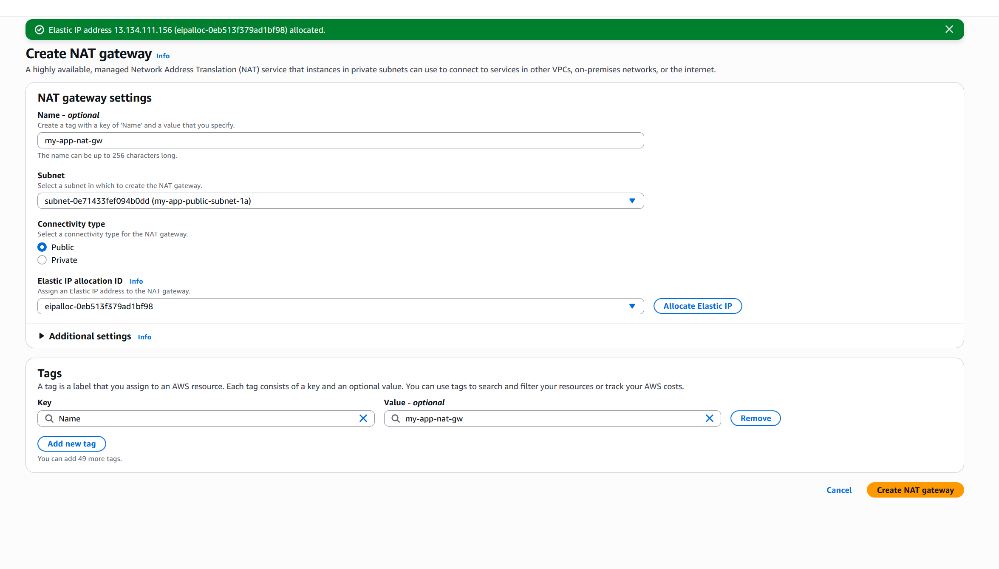
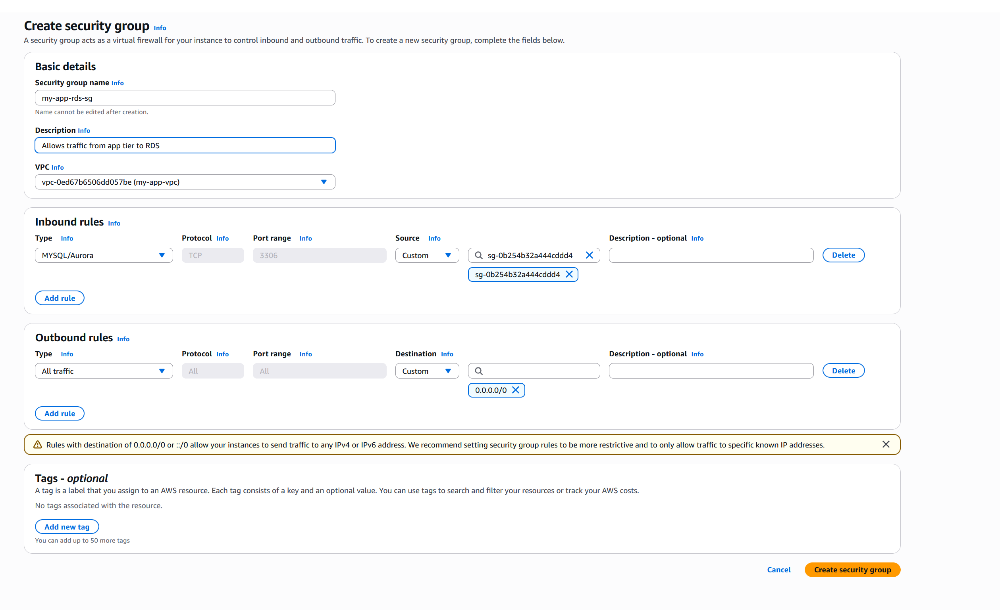
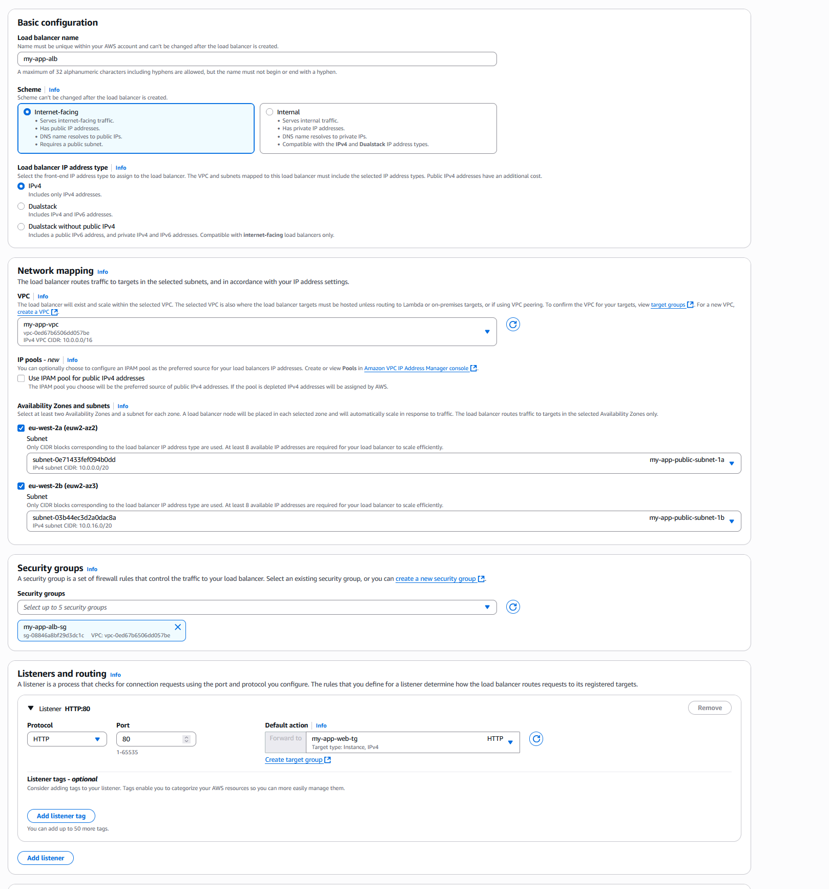
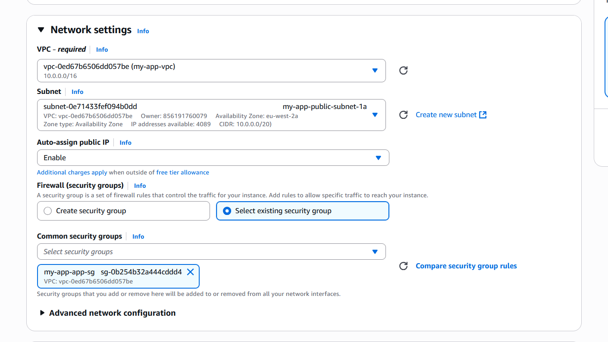
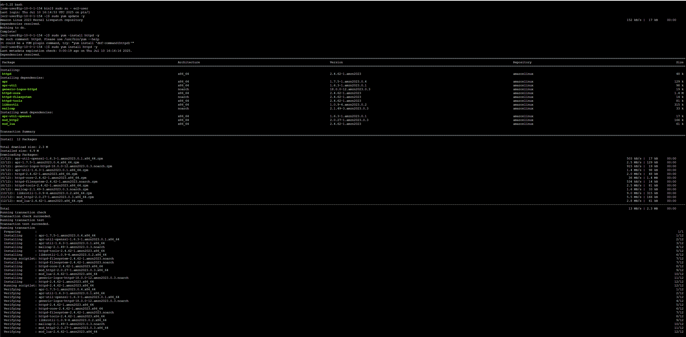
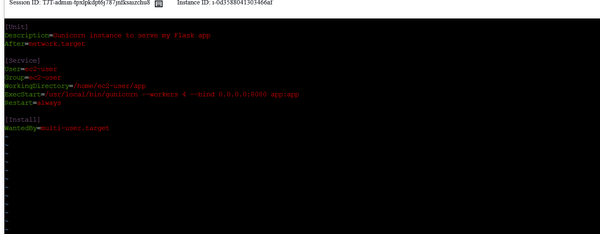

## Step 1: Create VPC
Create the isolated virtual network in AWS.

### Create VPC
   - Navigate to the VPC Dashboard:
    - Open the AWS Management Console. 
        - In the search bar, type VPC and select VPC under Services.
        - From the left navigation pane, choose Your VPC.
    - Initiate VPC Creation:
    - Click the *Create VPC button*.
    - Configure VPC Details:
        - VPC Only: Select this option.
    - Name tag: Enter `my-app-vpc`.
        - IPv4 CIDR block: Enter `10.0.0.0/16`.
        - No IPv6 CIDR block: Keep this as is.
        - Tenancy: Keep as Default.
     
   - Enable DNS Hostnames:
        - After creating the VPC, select `my-app-vpc` from the list.
        - Click Actions dropdown menu.
        - Choose Edit VPC settings.
        - Ensure Enable DNS hostnames is checked. If not, check it and click *Save changes*.
     

## Step 2: Create Public Subnets
Create two public subnets for high availability.

### Public Subnet 1: my-app-public-subnet-1a
   - Navigate to Subnets:
        - From the left navigation pane, choose Subnets.
   - Initiate Subnet Creation:
        - Click the *Create subnet button*.
   - Configure Subnet Details:
        - VPC ID: Select `my-app-vpc`.
        - Subnet name: Enter `my-app-public-subnet-1a`.
        - Availability Zone: Select `eu-west-2a`.
        - IPv4 CIDR block: Enter `10.0.0.0/20`.
   - Create Subnet:
        - Click *Create subnet*.
   - Enable Auto-assign Public IPv4 Address:
        - After the subnet is created, select `my-app-public-subnet-1a` from the list.
        - Click *Actions* dropdown menu.
        - Choose Modify auto-assign public IPv4 address.
        - Check Enable auto-assign public IPv4 address.
        - Click *Save*.
     
  
### Public Subnet 2: my-app-public-subnet-1b
   - Initiate Subnet Creation:
        - Click the Create subnet button again.
   - Configure Subnet Details:
        - VPC ID: Select `my-app-vp`c.
        - Subnet name: Enter `my-app-public-subnet-1b`.
        - Availability Zone: Select `eu-west-2b`.
        IPv4 CIDR block: Enter `10.0.16.0/20`.
   - Create Subnet:
        - Click Create subnet.
   - Enable Auto-assign Public IPv4 Address:
        - Select `my-app-public-subnet-1b` from the list.
        - Click Actions dropdown menu.
        - Choose Modify auto-assign public IPv4 address.
        - Check Enable auto-assign public IPv4 address.
        - Click Save.
     
## Step 3: Create Private Subnets
Create private subnets for resources that should not be directly accessible from the internet.

### Private Subnet 1: my-app-private-subnet-2a
   - Navigate to Subnets:
        - From the left navigation pane, choose Subnets.
   - Initiate Subnet Creation:
        - Click the *Create subnet button*.
   - Configure Subnet Details:
        - VPC ID: Select `my-app-vpc`.
        - Subnet name: Enter `my-app-private-subnet-2a`.
        - Availability Zone: Select `eu-west-2a` (match Public Subnet 1's AZ).
        - IPv4 CIDR block: Enter `10.0.32.0/20`.
   - Create Subnet:
        - Click *Create subnet*.
        - Do not enable auto-assign public IPv4 address for private subnets.
      

### Private Subnet 2: my-app-private-subnet-2b
   - Initiate Subnet Creation:
        - Click the *Create subnet button*.
   - Configure Subnet Details:
        - VPC ID: Select `my-app-vpc`.
        - Subnet name: Enter `my-app-private-subnet-2b`.
        - Availability Zone: Select `eu-west-2b` (match Public Subnet 2's AZ).
        - IPv4 CIDR block: Enter `10.0.48.0/20`.
   - Create Subnet:
        - Click *Create subnet*.
        - Do not enable auto-assign public IPv4 address for private subnets.
     
### Create Internet Gateway (IGW) & Route Tables
Create An Internet Gateway To allow communication between your VPC and the internet.

### Create Internet Gateway (my-app-igw)
   - Navigate to Internet Gateways:
        - From the left navigation pane, choose Internet Gateways.
   - Initiate IGW Creation:
        - Click *Create internet gateway*.
   - Configure IGW Details:
        - Name tag: Enter `my-app-igw`.
   - Create IGW:
        - Click **Create internet gateway*.
     
   - Attach IGW to VPC:
        - After creation, select `my-app-igw` from the list.
        - Click *Actions* dropdown menu.
        - Choose Attach to VPC.
        - Select `my-app-vpc` from the dropdown list.
        - Click *Attach internet gateway*.
     

### Create Public Route Table (my-app-public-rt)
   - Navigate to Route Tables:
        - From the left navigation pane, choose Route Tables.
   - Initiate Route Table Creation:
        - Click *Create route table*.
   - Configure Route Table Details:
        - Name tag: Enter `my-app-public-rt`.
        - VPC: Select `my-app-vpc`.
   - Create Route Table:
        - Click *Create route table*.
     
   - Add Route to Internet Gateway:
        - Select `my-app-public-rt` from the list.
        - Click the *Routes* tab.
        - Click *Edit routes*.
        - Click *Add* route.
        - Destination: Enter `0.0.0.0/0` (This means all traffic).
        - Target: Select Internet Gateway from the dropdown and then choose `my-app-igw`.
        - Click *Save changes*.
     
   - Associate Public Subnets with Public Route Table:
        - Select `my-app-public-rt`.
        - Click the *Subnet associations* tab.
        - Click *Edit subnet associations*.
        - Check the boxes next to `my-app-public-subnet-1a` and `my-app-public-subnet-1b`.
        - Click *Save associations*.
     

## Step 3: Create NAT Gateway & Private Route Table
Create A NAT Gateway To Allow Instances in private subnets to connect to the internet.

### Create NAT Gateway (my-app-nat-gw)
   - Navigate to NAT Gateways:
        From the left navigation pane, choose NAT Gateways.
   - Initiate NAT Gateway Creation:
        Click *Create NAT gateway*.
   - Configure NAT Gateway Details:
        Name tag: Enter `my-app-nat-gw`.
        Subnet: Select `my-app-public-subnet-1a` (the NAT Gateway must be in a public subnet).
        Connectivity type: Select Public.
        Elastic IP allocation: Click Allocate New Elastic IP Address.
   - Create NAT Gateway:
        Click *Create NAT Gateway*. Wait for the status to become Available.
     

### Create Private Route Table (my-app-private-rt)
   - Navigate to Route Tables:
        - From the left navigation pane, choose Route Tables.
   - Initiate Route Table Creation:
        - Click *Create route table*.
   - Configure Route Table Details:
        - Name tag: Enter `my-app-private-rt`.
        - VPC: Select `my-app-vpc`.
   - Create Route Table:
        - Click *Create route table*.
     
   - Add Route to NAT Gateway:
        - Select `my-app-private-rt` from the list.
        - Click the *Routes* tab.
        - Click *Edit routes*.
        - Click *Add route*.
        - Destination: Enter `0.0.0.0/0`.
        - Target: Select NAT Gateway from the dropdown and then choose `my-app-nat-gw`.
        - Click *Save changes*
     
   - Associate Private Subnets with Private Route Table:
        - Select `my-app-private-rt`.
        - Click the *Subnet associations* tab.
        - Click *Edit subnet associations*.
        - Check the boxes next to `my-app-private-subnet-2a` and `my-app-private-subnet-2b`.
        - Click *Save associations*.
     

## Step 4: Create Security Groups
Configure Security Groups that will control inbound and outbound traffic for your instances.

### Web Tier Security Group (my-app-web-sg)
   - Navigate to Security Groups:
        - From the left navigation pane, choose Security Groups.
   - Initiate Security Group Creation:
        - Click *Create security group*.
   - Configure Basic Details:
        - Security group name: Enter `my-app-web-sg`.
        - Description: Enter Allows HTTP from ALB, and allows inbound traffic to Web Tier EC2 instances.
        - VPC: Select `my-app-vpc`.
   - Configure Inbound Rules:
        - Click *Add rule*.
        - Type: Select HTTP.
        - Port range: 80.
        - Source: For now, select Anywhere-IPv4 (`0.0.0.0/0`). (Remember: You will update this later to the ALB's security group.)
   - Configure Outbound Rules:
        - Keep the default rule: Type: All traffic, Destination: `0.0.0.0/0`.
   - Create Security Group:
        - Click *Create security group*.
     

### App Tier Security Group (my-app-app-sg)
   - Initiate Security Group Creation:
        - Click *Create security group*.
   - Configure Basic Details:
        - Security group name: Enter `my-app-app-sg`.
        - Description: Enter Allows traffic from Web Tier to App Tier, and outbound to RDS.
        - VPC: Select `my-app-vpc`.
   - Configure Inbound Rules:
        - Click *Add rule*.
        - Type: Select Custom TCP.
        - Port range: 8080 (This is your Flask/Gunicorn port).
        Source: Start typing `my-app-web-sg` and select the Security Group ID of `my-app-web-sg` when it appears.
   - Configure Outbound Rules:
        - Keep the default rule: Type: All traffic, Destination: `0.0.0.0/0`.
   - Create Security Group:
        - Click *Create security group*.
     

### RDS Database Security Group (my-app-rds-sg)
   -  Initiate Security Group Creation:
        - Click *Create security group*.
   - Configure Basic Details:
        - Security group name: Enter `my-app-rds-sg`.
        - Description: Enter Allows traffic from App Tier to RDS instances.
        - VPC: Select `my-app-vpc`.
   - Configure Inbound Rules:
        - Click *Add rule*.
        - Type: Select MySQL.
        - Port range: 3306.
        - Source: Start typing `my-app-app-sg` and select the Security Group ID of `my-app-app-sg` when it appears.
   - Configure Outbound Rules:
        - Keep the default rule: Type: All traffic, Destination: `0.0.0.0/0`.
   - Create Security Group:
        - Click *Create security group*.
     

### ALB Security Group (my-app-alb-sg)
   - Initiate Security Group Creation:
        - Click *Create security group*.
   - Configure Basic Details:
        - Security group name: Enter `my-app-alb-sg`.
        - Description: Enter Allows inbound HTTP/HTTPS from internet to ALB.
        - VPC: Select `my-app-vpc`.
   - Configure Inbound Rules:
        - Click *Add rule*.
        - Type: Select HTTP.
        - Port range: 80.
        - Source: Select Anywhere-IPv4 (`0.0.0.0/0`).
        (Optional: If you plan to use HTTPS, add another rule for Type: HTTPS, Port range: 443, Source: `0.0.0.0/0`).
   - Configure Outbound Rules:
        - Keep the default rule: Type: All traffic, Destination: `0.0.0.0/0` (This allows the ALB to communicate with its target groups).
   - Create Security Group:
        - Click *Create security group*.
     

### Step 5: Create IAM Role For Session Manager
This IAM role will grant your EC2 instances the necessary permissions to be managed by AWS Systems Manager Session Manager, allowing you to connect to them without SSH keys.

   - Navigate to IAM Dashboard:
        - In the AWS Management Console search bar, type IAM and select IAM under Services.
        - From the left navigation pane, choose Roles.
   - Initiate Role Creation:
        - Click *Create role*.
   - Select Trusted Entity:
        - Trusted entity type: Select AWS service.
        - Use case: Select EC2 from the list.
        - Click *Next*.
     
   - Add Permissions:
        - In the search box, type AmazonSSMManagedInstanceCore and select the checkbox next to it.
        - Click *Next*.
   - Name and Review:
        - Role name: Enter `my-app-ec2-ssm-role`.
        - (Optional: Add a description for the role).
        - Review the policy attached (AmazonSSMManagedInstanceCore).
   - Create Role:
        - Click *Create role*.
     

## Step 6: RDS Database Setup
This phase involves setting up your Relational Database Service (RDS) instance for your application's data storage.

### Create Database Subnet Group

This groups your private subnets for RDS to use, ensuring your database is highly available across multiple Availability Zones.
   - Navigate to RDS Dashboard:
        - In the AWS Management Console search bar, type RDS and select RDS under Services.
        - From the left navigation pane, choose Subnet groups.
   - Initiate DB Subnet Group Creation:
        - Click *Create DB subnet group*.
   - Configure Subnet Group Details:
        - Name: Enter `my-app-rds-subnet-group`.
        - Description: Enter Subnet group for `my-app` RDS database.
        - VPC: Select `my-app-vpc`.
        - Availability Zones: Select both eu-west-2a and eu-west-2b.
        - Subnets: For each selected AZ, choose the corresponding private subnet: `my-app-private-subnet-2a` (`for eu-west-2a`) and `my-app-private-subnet-2b` (`for eu-west-2b`).
   - Create Subnet Group:
        - Click *Create*.
     

### Launch RDS DB Instance
   - Navigate to Databases:
        - From the left navigation pane, choose Databases.
   - Initiate Database Creation:
        - Click *Create database*.
   - Choose Creation Method:
        - Select Standard create.
   - Engine Options:
        - Engine type: Select MySQL
        - Engine version: Choose the latest compatible version.
        - Templates: Select Free tier for testing purposes.
     
   - DB instance identifier:
        - Enter `my-app-db`.
   - Credentials:
        - Master username: Enter `admin`.
        - Master password: Enter `MyStrongDBPassword123!`
     
   - DB instance size:
        - For Free tier, db.t2.micro will be automatically selected. For Production, choose db.t3.micro or similar.
   - Connectivity:
        - Virtual private cloud (VPC): Select `my-app-vpc`.
        - Subnet group: Select `my-app-rds-subnet-group`.
        - Publicly accessible: Select No. (Your database should not be directly accessible from the internet).
        - VPC security groups: Choose Choose existing VPC security groups. Then, select `my-app-rds-sg`.
        - Database authentication: Select Password authentication.
   - Additional configuration:
        - Initial database name: Enter `mydb`.
   - Review and Create:
        - Review all settings.
        - Click *Create database*. This process can take several minutes.
   - Note Down the RDS Endpoint:
        - Once the database status is Available, click on `my-app-db`.
        - Under the Connectivity & security tab, find the Endpoint and Port. Copy this endpoint as you will need it for your application configuration (Phase 7).

## Step 7: Create The Load Balancer
An Application Load Balancer (ALB) distributes incoming application traffic across multiple targets, such as EC2 instances.
 
### Create Target Groups

Target groups are used by the Load Balancer to route requests to one or more registered targets.
Web Tier Target Group (`my-app-web-tg`)
   - Navigate to EC2 Dashboard:
        - In the AWS Management Console search bar, type EC2 and select EC2 under Services.
        - From the left navigation pane, under Load Balancing, choose Target Groups.
   - Initiate Target Group Creation:
        - Click *Create target group*.
   - Choose Target Type:
        - Choose a target type: Select Instances.
   - Configure Basic Details:
        - Target group name: Enter `my-app-web-tg`.
        - Protocol: HTTP.
        - Port: 80.
        - VPC: Select `my-app-vpc`.
   - Health Checks:
        - Health check protocol: HTTP.
        - Health check path: / .
        - Keep default advanced health check settings for now.
   - Create Target Group:
        - Click *Next step* and then *Create target group*. (You will register targets later after launching EC2 instances).
     

### Create Application Load Balancer (ALB)
This is the entry point for your web traffic.

   - Navigate to Load Balancers:
        - From the left navigation pane, under Load Balancing, choose Load Balancers.
   - Initiate Load Balancer Creation:
        - Click *Create Load Balancer*.
   - Select Load Balancer Type:
        - Under Application Load Balancer, click *Create*.
   - Configure Basic Details:
        - Load balancer name: Enter `my-app-alb`.
        - Scheme: Select Internet-facing.
        - IP address type: Select IPv4.
   - Network Mapping:
        - VPC: Select `my-app-vpc`.
        - Mappings: Select both eu-west-2a and eu-west-2b. For each AZ, select its corresponding public subnet: `my-app-public-subnet-1a` and `my-app-public-subnet-1b`.
   - Security Groups:
        - Security groups: Select `my-app-alb-sg`.
   - Listeners and Routing:
        - Listener protocol: HTTP.
        - Port: 80.
        - Default action: Select Forward to and choose `my-app-web-tg` (your Web Tier Target Group) from the dropdown.
   - Review and Create:
        - Click *Create load balancer*. This may take a few minutes to provision.
     

### Update Web Tier Security Group

Now that the ALB is created, you can update the Web Tier Security Group to only allow traffic from the ALB, enhancing security.
   - Navigate to Security Groups:
        - From the left navigation pane, choose Security Groups.
   - Edit Web Tier Security Group:
        - Select `my-app-web-sg`.
        - Click the *Inbound rules* tab.
        - Click *Edit inbound rules*.
   - Modify HTTP Rule:
        - Find the existing HTTP rule (Port 80) that currently has 0.0.0.0/0 as its source.
        - Click in the *Source column*, and start typing `my-app-alb-sg`. Select the Security Group ID of `my-app-alb-sg` when it appears.
        - Click *Save rules*.
     

## Step 8: Web Tier (Apache) Setup

This involves launching your Web Tier EC2 instances and configuring them to serve web content and proxy requests to your Application Tier.

### Launch EC2 Instances (Web Tier)
   - Navigate to EC2 Dashboard:
        In the AWS Management Console search bar, type EC2 and select EC2 under Services.
        From the left navigation pane, choose Instances.
   - Initiate Instance Launch:
        Click *Launch instances*.
   - Configure Instance Details:
        - Name and tags:
            - Name: Enter `my-app-web-instance`.
     
        - Application and OS Images (Amazon Machine Image):
            - AMI: Select Amazon Linux 2 AMI (HVM, SSD Volume Type) or Amazon Linux 2023 AMI.
        - Instance type:
            - Select t2.micro (or t3.micro for general use).
        - Key pair (login):
            - Select Proceed without a key pair. (You will use Session Manager for access).
        - Network settings:
            - Click *Edit*.
            - VPC: Select `my-app-vpc`.
            - Subnet: Select `my-app-public-subnet-1a`. (If launching multiple, launch one in `my-app-public-subnet-1a` and another in `my-app-public-subnet-1b`).
            - Auto-assign Public IP: Select Enable.
            - Firewall (security groups): Choose Select an existing security group and select `my-app-web-sg`.
     
        - Configure storage: Keep defaults for now.
        - Advanced details:
            - IAM instance profile: Select `my-app-ec2-ssm-role`.
     
   - Connect to the Instance via Session Manager:
        - Once the instance is Running, select it in the EC2 console.
        - Click the *Connect* button.
        - Choose the Session Manager tab.
        - Click *Connect*. This will open a shell directly in your browser.
               
`bash`
`sudo su - ec2-user`
`sudo yum update -y`
`sudo yum install httpd -y`
    
`sudo systemctl start httpd`
`sudo systemctl enable httpd`

`sudo vim /etc/httpd/conf.d/my-app.conf`
*paste the below code in the file*
`<VirtualHost *:80>`
  ` ServerAdmin webmaster@localhost`
   `DocumentRoot /var/www/html`
 `  ErrorLog /var/log/httpd/error_log`
  ` CustomLog /var/log/httpd/access_log combined`

   `ProxyPreserveHost On`
   `ProxyRequests Off`
   `ProxyPass / http://YOUR_ACTUAL_APP_TIER_PRIVATE_IP:8080/`
   `ProxyPassReverse / http://YOUR_ACTUAL_APP_TIER_PRIVATE_IP:8080/`
`</VirtualHost>`

`sudo systemctl restart httpd`

## Step 9: App Tier (Flask/Gunicorn) Setup

This phase sets up your application backend, which will connect to your database.

### Launch EC2 Instance (App Tier)
   - Navigate to EC2 Dashboard:
        - From the left navigation pane, choose Instances.
   - Initiate Instance Launch:
        - Click *Launch instances*.
   - Configure Instance Details:
        - Name and tags:
            - Name: Enter `my-app-app-instance`.
        - Application and OS Images (Amazon Machine Image):
            - AMI: Select Amazon Linux 2 AMI (HVM, SSD Volume Type) or Amazon Linux 2023 AMI.
        - Instance type:
            - Select t2.micro (or t3.micro).
        - Key pair (login):
            - Select Proceed without a key pair.
     
        - Network settings:
            - Click *Edit*.
            - VPC: Select `my-app-vpc`.
            - Subnet: Select `my-app-private-subnet-2a`.
            - Auto-assign Public IP: Select Disable. (This is a private subnet instance).
            - Firewall (security groups): Choose Select an existing security group and select `my-app-app-sg`.
     
        - Configure storage: Keep defaults for now.
        - Advanced details:
            - IAM instance profile: Select `my-app-ec2-ssm-role`.
     
            - Click *Create Instance*
            .
   - Connect to the Instance via Session Manager:
        - Once the instance is Running, select it in the EC2 console.
        - Click the *Connect button*.
        - Choose the Session Manager tab.
        - Click *Connect*. This will open a shell directly in your browser.    

`bash`
`sudo su - ec2-user`
`sudo yum update -y`
`sudo yum install mariadb1011-client-utils -y `
`sudo yum install git -y`
`sudo yum install python3-pip -y`
`sudo pip3 install Flask PyMySQL gunicorn`
    

`mkdir /home/ec2-user/app`
`vim /home/ec2-user/app/app.py `
 *paste the below code in the file*

`from flask import Flask`
`import pymysql`

`app = Flask(__name__)`

`DB_HOST = "YOUR_RDS_ENDPOINT"`
`DB_USER = "YOUR_DB_USERNAME"`
`DB_PASSWORD = "YOUR_DB_PASSWORD"`
`DB_NAME = "YOUR_DB_NAME"`

`@app.route('/')`
`def hello_world():`
    `try:`
        `conn = pymysql.connect(host=DB_HOST, user=DB_USER, password=DB_PASSWORD, database=DB_NAME, connect_timeout=5)`
        `cursor = conn.cursor()`
        `cursor.execute("SELECT VERSION()")`
        `db_version = cursor.fetchone()[0]`
        `cursor.close()`
        `conn.close()`
        `return f"<h1>App Tier - Hello from {app.instance_path}! Connected to MySQL: {db_version}</h1>"`
     `except Exception as e:`
        `return f"<h1>App Tier - Hello from {app.instance_path}! Database connection failed: {e}</h1>", 500`

`if __name__ == '__main__':`
`   app.run(host='0.0.0.0', port=8080)`
    

*create the systemd file*
`sudo vim /etc/systemd/system/flaskapp.service`
*paste the belwo code into the file*
`[Unit]`
`Description=Gunicorn instance to serve my Flask app`
`After=network.target`

`[Service]`
`User=ec2-user`
`Group=ec2-user`
`WorkingDirectory=/home/ec2-user/app`
`ExecStart=/usr/local/bin/gunicorn --workers 4 --bind 0.0.0.0:8080 app:app`
`Restart=always`

`[Install]`
`WantedBy=multi-user.target`
    

`sudo systemctl daemon-reload`
`sudo systemctl start flaskapp`
`sudo systemctl enable flaskapp`

## Step 10: Verification:

Verify Target Group Health Checks: 
   - Go to the `my-app-web-tg` Target Group. Check the Targets tab. The health status of your registered instances should eventually show as healthy.
    
   - Test the Application:
        - Go to Load Balancers under EC2.
        - Select `my-app-alb`.
        - Under the Description tab, copy the DNS name of the Load Balancer.
        - Paste this DNS name into your web browser. You should see the output from your Flask application, including the MySQL version if the database connection is successful.
     
   - Test connection to RDS:
`mysql -h  my-appd-db.cj82y0c0a8tc.eu-west-2.rds.amazonaws.com -P 3306 -u admin -p`
      *enter the password MyStrongDBPassword123!*
        - If successful you should be connect.
     

     